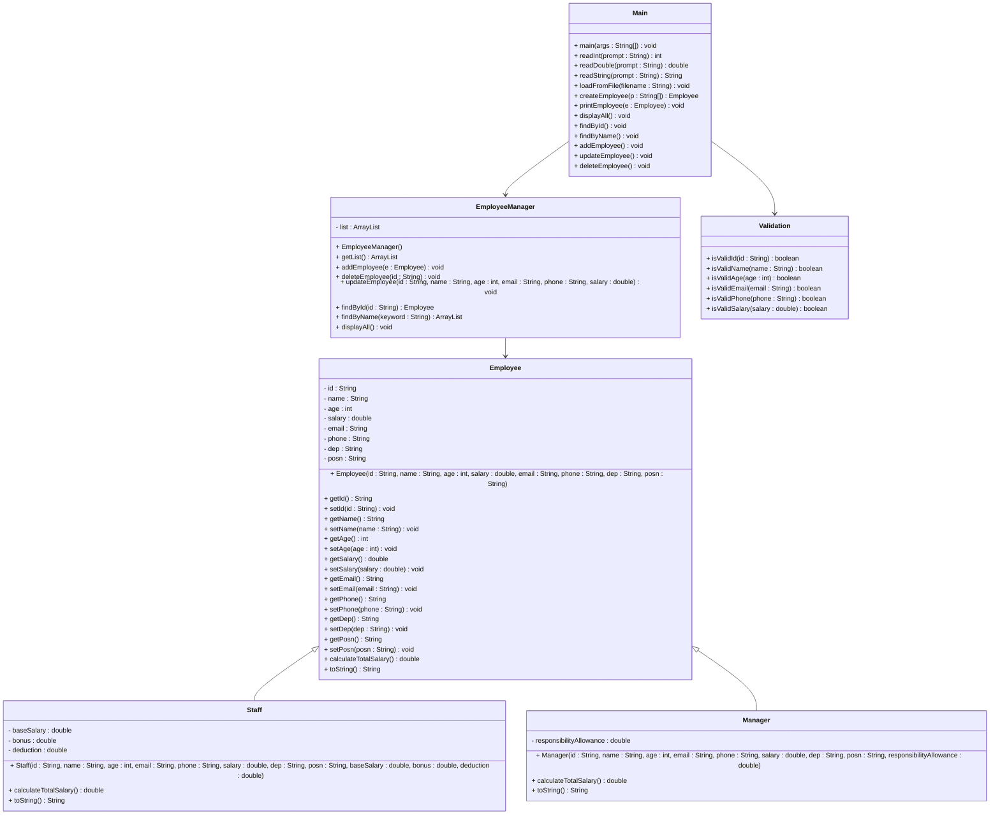

```mermaid
classDiagram

class Employee {
    - id : String
    - name : String
    - age : int
    - salary : double
    - email : String
    - phone : String
    - dep : String
    - posn : String

    + Employee(id : String, name : String, age : int, salary : double, email : String, phone : String, dep : String, posn : String)
    + getId()  String
    + setId(id : String)  void
    + getName()  String
    + setName(name : String)  void
    + getAge()  int
    + setAge(age : int)  void
    + getSalary()  double
    + setSalary(salary : double)  void
    + getEmail()  String
    + setEmail(email : String)  void
    + getPhone()  String
    + setPhone(phone : String)  void
    + getDep()  String
    + setDep(dep : String)  void
    + getPosn()  String
    + setPosn(posn : String)  void
    + calculateTotalSalary()  double
    + toString()  String
}

class Staff {
    - baseSalary : double
    - bonus : double
    - deduction : double

    + Staff(id : String, name : String, age : int, email : String, phone : String, salary : double, dep : String, posn : String, baseSalary : double, bonus : double, deduction : double)
    + calculateTotalSalary()  double
    + toString()  String
}

class Manager {
    - responsibilityAllowance : double

    + Manager(id : String, name : String, age : int, email : String, phone : String, salary : double, dep : String, posn : String, responsibilityAllowance : double)
    + calculateTotalSalary()  double
    + toString()  String
}

class EmployeeManager {
    - list : ArrayList<Employee>

    + EmployeeManager()
    + getList()  ArrayList<Employee>
    + addEmployee(e : Employee)  void
    + deleteEmployee(id : String)  void
    + updateEmployee(id : String, name : String, age : int, email : String, phone : String, salary : double)  void
    + findById(id : String)  Employee
    + findByName(keyword : String)  ArrayList<Employee>
    + displayAll()  void
}

class Validation {
    + isValidId(id : String)  boolean
    + isValidName(name : String)  boolean
    + isValidAge(age : int)  boolean
    + isValidEmail(email : String)  boolean
    + isValidPhone(phone : String)  boolean
    + isValidSalary(salary : double)  boolean
}

class Main {
    + main(args : String[])  void
    + readInt(prompt : String)  int
    + readDouble(prompt : String)  double
    + readString(prompt : String)  String
    + loadFromFile(filename : String)  void
    + createEmployee(p : String[])  Employee
    + printEmployee(e : Employee)  void
    + displayAll()  void
    + findById()  void
    + findByName()  void
    + addEmployee()  void
    + updateEmployee()  void
    + deleteEmployee()  void
}

Employee <|-- Staff
Employee <|-- Manager
EmployeeManager --> Employee
Main --> EmployeeManager
Main --> Validation
```
